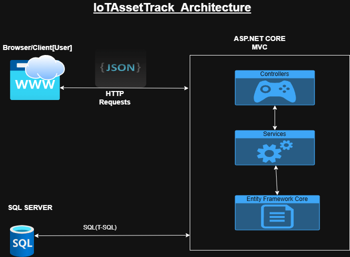
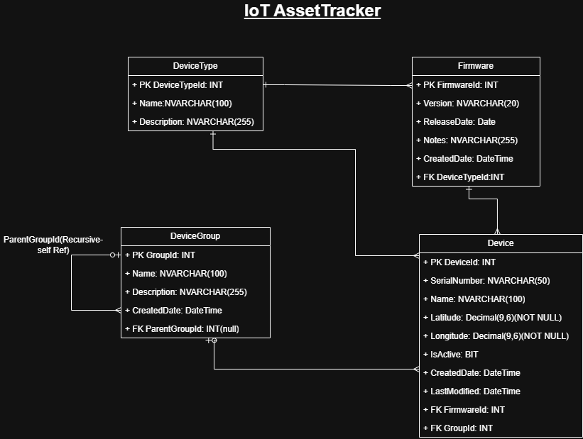
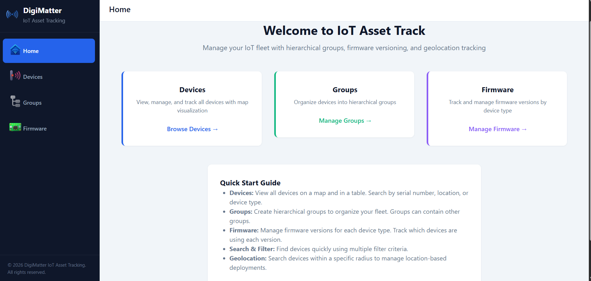
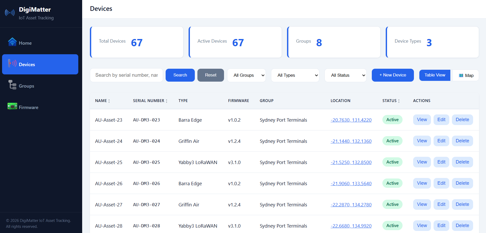
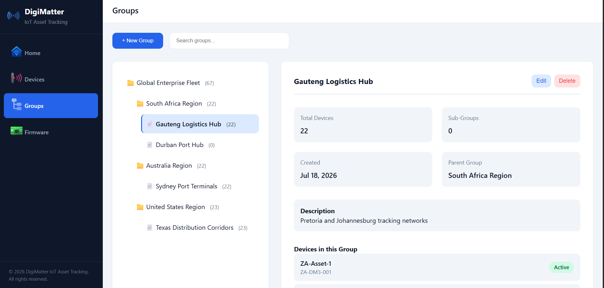
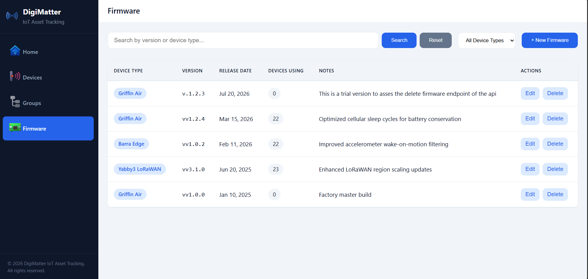

# DigiMatter IoT Asset Track

An IoT asset tracking and sensor monitoring solution.

The application demonstrates the management of IoT devices, versioned firmware, and hierarchical device groups through a RESTful ASP.NET Core backend and a responsive web frontend.

---

## Live Demo

**Application:**  
> *(Add  Render URL here once deployed)*

**Source Code:**  
> https://github.com/AustinAManyoka/DigiMatterIoTAssetTrack-Monitoring

---

# Features

### Device Management
- Create, view and update IoT devices
- Assign devices to firmware versions
- Assign devices to hierarchical groups
- Store GPS coordinates
- Active/Inactive device status
- Search, filtering and pagination
- Interactive map using Leaflet and OpenStreetMap

### Firmware Management
- CRUD operations
- Versioned firmware per device type
- Prevent duplicate firmware versions

### Device Groups
- Unlimited parent-child hierarchy
- Cycle prevention
- Group assignment for devices

---

# Technology Stack

## Backend

- ASP.NET Core 10 (.NET 10)
- C#
- Entity Framework Core
- Dapper
- SQL Server

## Frontend

- HTML5
- CSS3
- JavaScript (ES6)
- Bootstrap
- Leaflet.js
- OpenStreetMap

---

# Project Structure

```text
DigiMatterIoTAssetTrack-Monitoring/
│
├── README.md
├── LICENSE
│
├── src/
│   ├── backend/
│   │   ├── IoTAssetTrack.sln
│   │   ├── IoTAssetTrack.Api/
│   │   ├── IoTAssetTrack.Application/
│   │   ├── IoTAssetTrack.Domain/
│   │   └── IoTAssetTrack.Infrastructure/
│   │
│   └── frontend/
│       ├── index.html
│       ├── devices.html
│       ├── groups.html
│       ├── firmware.html
│       ├── css/
│       ├── js/
│       └── public/
│           └── images/
│
├── database/
│   ├── 01_CreateDatabase.sql
│   │ 
│   └── 02_SeedData.sql 
│
└── docs/
    └── images/
        ├── IoTAssetTrack_Architecture.png
        └── IoTAssetTrack_DigiMatter_databaseSchema.png
```

---

# Architecture

The application follows an N-tier architecture to separate responsibilities between presentation, business logic, domain models and data access.

### Layers

- **API Layer** – Exposes REST endpoints and serves the frontend.
- **Application Layer** – Implements business rules and validation.
- **Domain Layer** – Contains entity models and domain logic.
- **Infrastructure Layer** – Handles SQL Server access using Entity Framework Core and Dapper.

### Architecture Diagram



---

# Database Schema

| Table | Description |
|--------|-------------|
| **DeviceType** | Hardware profiles supported by the platform |
| **Firmware** | Versioned firmware associated with a device type |
| **DeviceGroup** | Hierarchical parent-child device groups |
| **Device** | Individual IoT devices with firmware, location and group assignment |

### Entity Relationship Diagram



---

# Frontend Pages

| Page | Description |
|------|-------------|
| Home | Landing page and navigation |
| Devices | Device management with table and map views |
| Groups | Hierarchical group management |
| Firmware | Firmware version management |

---
# Home Page


# Devices Page


# Groups Page


# Firmware Page


# Getting Started

## Prerequisites

- .NET 10 SDK
- SQL Server (Express, LocalDB or Developer Edition)
- Visual Studio 2022 (recommended)

---

## Clone the Repository

```bash
git clone https://github.com/AustinAManyoka/DigiMatterIoTAssetTrack-Monitoring.git

cd DigiMatterIoTAssetTrack-Monitoring
```

---

## Database Setup

Execute the SQL scripts in the following order:

```text
database/
    01_CreateDatabase.sql
    02_SeedData.sql
```

These scripts will:

- Create the database
- Create all tables
- Configure relationships and constraints
- Insert sample data

---

## Configure the Connection String

Open:

```text
src/backend/IoTAssetTrack.Api/appsettings.json
```

Update the connection string if necessary.

```json
{
  "ConnectionStrings": {
    "DefaultConnection": "Server=localhost;Database=DigiMatterAssetTrack_db;Trusted_Connection=True;TrustServerCertificate=True;"
  }
}
```

---

## Run the Backend

```bash
cd src/backend

dotnet restore

dotnet run --project IoTAssetTrack.Api
```

The API will start locally.

Example:

```
https://localhost:5197
```

---

## Run the Frontend

If serving the frontend separately:

```bash
cd src/frontend
```

Open `index.html` using:

- Visual Studio Code Live Server

or

```bash
python -m http.server
```

---

# Assumptions

- A device belongs to one firmware version.
- Firmware belongs to a single device type.
- Device groups support unlimited hierarchy levels.
- Devices may optionally belong to a group.
- GPS coordinates use the WGS84 coordinate system.

---

# Future Improvements


- Unit and integration testing
- Soft delete support
- Audit logging
- Docker support
- SignalR for real-time device updates


---

# Author

**Andani Austin Manyoka**

Junior Software Developer

University of Pretoria

BScHons Geoinformatics

---

# License

This project is provided for assessment purposes.

See the [LICENSE](LICENSE) file for details.
